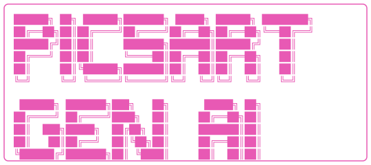

# gen-ai

<p align="center">
  
</p>

Picsart's terminal CLI for generating images, video, and audio with every model
Picsart supports — single-shot, interactive, scripted, batch, or piped.

```bash
gen-ai generate -m flux-pro -p "studio shot of a ceramic cup" -s
```

> Run `gen-ai` with no arguments to see the banner above and a numbered menu
> of every command, grouped by **Create / Edit / Utility / Browse / Manage /
> Account**. The terminal version is colorized in Picsart gold.

---

## Install

### npm (any platform)

```bash
npm install -g @picsart/gen-ai
```

Requires **Node.js 22 or newer**.

### macOS / Linux (signed binary, no Node required)

```bash
curl -fsSL https://picsart.com/gen-ai-cli/install.sh | bash
```

### Windows (PowerShell)

```powershell
iwr https://picsart.com/gen-ai-cli/install.ps1 | iex
```

After install, verify:

```bash
gen-ai --version
```

---

## Quick start

```bash
gen-ai login                                           # one-time browser auth
gen-ai generate                                        # interactive wizard
gen-ai generate -m flux-2-pro -p "neon ramen shop" -s  # one-shot, no prompts
gen-ai                                                 # launch REPL
```

`-s` is shorthand for `--no-input` (also available as `--silent`). It disables
interactive prompts but does not imply quiet or JSON output. For clean machine
output, combine `--no-input --quiet --json`.

---

## Discovering commands

Every command and flag is self-documented. Some good entry points:

```bash
gen-ai --help                  # global help with the full command tree
gen-ai generate --help         # all generation flags, input types, output options
gen-ai remove-bg --help        # background-removal options
gen-ai enhance --help          # upscale & enhancement options
gen-ai models --help           # filter / browse models by mode, provider, type
gen-ai batch run --help        # manifest format, concurrency, resume options
gen-ai pricing --help          # cost calculation with duration, resolution, audio
gen-ai config set --help       # all settings keys with types and descriptions
```

Inside the REPL you can:

- **Type a number** matching a menu shortcut to jump straight into that operation
- **Type a command name** (with or without flags) — e.g. `generate -m flux-2-pro`
- **Type `<command> --help`** to render a card-styled help for that command
- **Type `quit` / `exit`** or hit `Ctrl-C` twice to quit

---

## Authentication

```bash
gen-ai login      # opens Picsart SSO in your browser
gen-ai whoami     # shows the current user
gen-ai logout     # clears credentials
gen-ai credits    # remaining credits on your account
```

Credentials are stored at `~/.gen-ai/credentials.json` (mode 600). The CLI
auto-refreshes the access token on 401 — `gen-ai login` again if refresh fails.

---

## Commands

### Generation

| Command | What it does |
|---|---|
| `gen-ai generate` | Generate an image, video, or audio from any model |
| `gen-ai redo` | Re-run the previous generation |
| `gen-ai extend` | Extend a VEO video by 7 seconds (chainable with `--times`) |
| `gen-ai remove-bg` | Remove the background from an image |
| `gen-ai change-bg` | Replace the background of an image |
| `gen-ai enhance` | Upscale / enhance an image |
| `gen-ai vectorize` | Convert a raster image to SVG |

All operations follow the same pipeline: parse flags → resolve inputs (interactive or scripted) → execute → handle output (display, download, save to Drive, write history).

### Models

| Command | What it does |
|---|---|
| `gen-ai models` | Browse the full catalog with badges and pricing |
| `gen-ai models info <id>` | Detailed card for one model |
| `gen-ai models compare <a> <b>` | Side-by-side comparison |

### Batch

| Command | What it does |
|---|---|
| `gen-ai batch run <manifest.json>` | Run a JSON manifest of generations in parallel |
| `gen-ai batch status <output-dir>` | Check progress from a batch output directory or `results.json` |
| `gen-ai batch resume <output-dir>` | Re-run failed jobs from a previous output directory |
| `gen-ai batch schema` | Print the batch manifest JSON Schema |

### Drive (Picsart cloud storage)

| Command | What it does |
|---|---|
| `gen-ai upload <files...>` | Upload local files / folders to Drive |
| `gen-ai download <uid>` | Download a Drive file |
| `gen-ai list [--folders]` | List Drive folders or files (JSON-ready) |

### History

| Command | What it does |
|---|---|
| `gen-ai history` | Recent generations |
| `gen-ai history last` | Show the most recent generation in detail |
| `gen-ai history files` | Recently used input files (clipboard / picker memory) |
| `gen-ai history clear` | Clear local history |

### Config

| Command | What it does |
|---|---|
| `gen-ai config list` | Show all settings |
| `gen-ai config keys` | Show available keys with their types |
| `gen-ai config get <key>` | Read one value |
| `gen-ai config set <key> <value>` | Persist a default |
| `gen-ai config unset <key>` | Revert to default |

Available keys: `defaultModel`, `downloadDir`, `autoOpen`, `autoClipboard`,
`autoBell`, `autoNotify`, `recentFilesCount`, `imagePreview`, `autoUpdate`.

### Other

| Command | What it does |
|---|---|
| `gen-ai pricing` | Credit cost for any operation |
| `gen-ai validate` | Pre-flight check: payload, params, credits |
| `gen-ai update` | Self-update to the latest version |
| `gen-ai version` | Print version |
| `gen-ai completion <bash\|zsh\|fish>` | Print shell completion script |

Run `gen-ai <command> --help` for full flag details on any command.

---

## Common flags

| Flag | Effect |
|---|---|
| `-m, --model <id>` | Pick a model (skips the model picker) |
| `-p, --prompt <text>` | Provide the prompt inline |
| `-i, --image <path-or-url>` | Image input (repeatable) |
| `--seed <N>` | Reproducible output (flux / seedance / seedream / wan / qwen) |
| `--input-dir <dir>` | Run the same operation across every file in a folder |
| `-s, --no-input` (`--silent`) | Fail instead of opening an interactive prompt |
| `--json` | Emit machine-readable JSON to stdout |
| `--quiet, -q` | Suppress info / progress |
| `--no-color` | Strip ANSI colors |
| `--debug` | Verbose diagnostic output |
| `-o, --open` / `--no-open` | Enable or disable opening the result |
| `--download <dir>` (`--out`) | Download result to a directory |
| `--save-to-drive` / `--no-save-to-drive` | Enable or disable the default Drive save |
| `--drive-folder <name>` (`--folder`) | Drive folder, default `gen-ai-cli` |

---

## Model-specific flags

These flags only take effect on models whose `paramConfig` declares the matching descriptor. Pass them to any other model and the SDK silently ignores them.

| Flag | Where it applies |
|---|---|
| `--seed <N>` | flux, seedance, seedream, wan, qwen (image / video) |
| `--language <code>` | ElevenLabs TTS — `en`, `fr`, `de`, … |
| `--voice <id>` | ElevenLabs TTS, audio models with named voices |
| `--rendering-speed` | Ideogram v3 / Character (`FLASH`/`TURBO`/`DEFAULT`/`QUALITY`); Kling video T2V/I2V and Kling Avatar (`std`/`pro`) |
| `--video-id <id>` | Chained ops that reference an existing generation |
| `--remove-bg-noise` | ElevenLabs Speech-to-Speech (`eleven-sts-v2`, `eleven-multilingual-sts-v2`) |
| `--source-image-id <id>` | `recraft-explore-similar` (variations of an existing asset) |
| `--similarity <1-5>` | `recraft-explore-similar` |

```bash
# Reproducible image — same prompt + seed = same result
gen-ai generate -m flux-2-pro -p "a red cat" --seed 12345

# ElevenLabs TTS with explicit language
gen-ai generate -m eleven-v3 -p "Hello world" --language en

# Recraft Explore Similar — generate variations of an existing asset
gen-ai generate -m recraft-explore-similar --source-image-id abc123 --similarity 4

# ElevenLabs STS with background-noise removal
gen-ai generate -m eleven-sts-v2 --audio voice.mp3 --remove-bg-noise
```

---

## Piping & scripting

The CLI is pipe-aware:

```bash
echo "logo for a coffee shop" | gen-ai generate -m flux-pro -s
```

Combined with `--json`, it composes well with `jq`:

```bash
gen-ai generate -m flux-pro -p "tabby cat" -s | jq -r '.result.url'
```

`--no-input` prevents any interactive prompt — fail fast in CI rather than
hanging on a missing flag.

---

## Environment variables

| Variable | Purpose |
|---|---|
| `GEN_AI_API_URL` | Override the API endpoint |
| `GEN_AI_UPLOAD_URL` | Override the upload endpoint |
| `PICSART_CLI_VERSION` | Build-time version string (set by tsup) |
| `NO_COLOR` | Standard NO_COLOR — disables ANSI when set |

Example: point the CLI at an alternate environment for one run, without
changing your saved config:

```bash
GEN_AI_API_URL=https://api.example.com \
GEN_AI_UPLOAD_URL=https://upload.example.com \
gen-ai generate ...
```

Both must be HTTPS (`http://localhost` is allowed for local development).

---

## Local data

Everything the CLI persists lives under `~/.gen-ai/`:

| File | Purpose |
|---|---|
| `credentials.json` | OAuth tokens (mode 600) |
| `config.json` | User preferences set via `config set` |
| `history.json` | Generation history (capped at 500 entries) |
| `recent-files.json` | Recently used input files |
| `device-id` | Anonymous UUIDv4 for analytics |
| `update-check.json` | Cached version-check timestamp |
| `debug.log` | Crash reports (only written on unexpected errors) |

To fully reset: `rm -rf ~/.gen-ai/`.

---

## Analytics & privacy

The CLI sends usage telemetry alongside API requests. It contains:

- `version` — CLI version
- `app_session_id` — UUIDv7, regenerated each time `gen-ai` starts; one ID covers a full REPL session
- `app_device_id` — UUIDv4, generated once and stored at `~/.gen-ai/device-id`
- `country_code`, `timezone`, `locale_code` — derived from your system locale
- `user_id` when the CLI is authenticated

We never send file contents, prompts, or generated results to anywhere other
than the Picsart API endpoint you'd already be calling. Set `PULSE_OPT_OUT=1`
to disable analytics.

---

## Shell completion

Bash:

```bash
gen-ai completion bash > ~/.local/share/bash-completion/completions/gen-ai
```

Zsh:

```bash
gen-ai completion zsh > "${fpath[1]}/_gen-ai"
```

Fish:

```bash
gen-ai completion fish > ~/.config/fish/completions/gen-ai.fish
```

---

## REPL mode

Run `gen-ai` with no arguments to enter the interactive REPL — a numbered
menu, fuzzy model picker, image preview support (iTerm2 / Kitty), and
clipboard-aware file input. Type `help` for help and `quit` to exit.

---

## Troubleshooting

**"Token refresh failed"** → run `gen-ai login` again.

**"Insufficient credits"** → `gen-ai credits` to check; top up at
[picsart.com](https://picsart.com).

**Hanging on input** → add `--no-input` to error out instead of prompting.

**Crash with no detail** → re-run with `--debug`, then check
`~/.gen-ai/debug.log`.

**Want to see the exact request being sent** → set
`GEN_AI_API_URL=http://localhost:PORT` and point at a local proxy.

---

## Architecture

The CLI uses a 5-layer pipeline (entry → commands → resolvers → execution →
output) with strict import boundaries enforced by `dependency-cruiser`. See
[ARCHITECTURE.md](./ARCHITECTURE.md) for the full layout.

Models live in `@picsart/ai-sdk`, published from the external `pa-gen-ai-sdk`
repo, not in the CLI itself — adding a model there and bumping the pin here
makes it appear in `gen-ai` automatically.

---

## Links

- Picsart: https://picsart.com
- API docs: https://docs.picsart.io
- Issues: https://github.com/PicsArt/gen-ai-cli/issues

## License

MIT © Picsart
