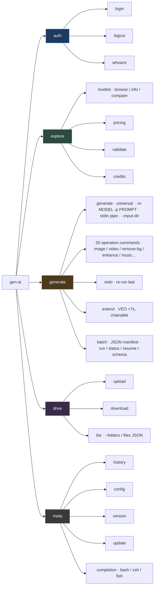
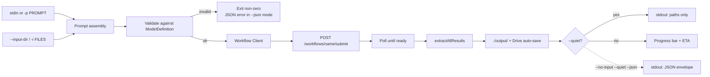

# `gen-ai` CLI — Technical Specification

> Status: **shipped** · Package: **`@picsart/gen-ai`** (standalone repo)
>
> **Canonical layout reference:** [`ARCHITECTURE.md`](../ARCHITECTURE.md). This page is the **command + flag reference**; the architecture doc owns the source-tree layout. The "Phase N" sections below are the original build plan kept for historical context — the commands and flags they describe are accurate, but the *file paths* in those sections predate the current 5-layer architecture (see "Source layout" below). When the two disagree, `ARCHITECTURE.md` and the code win.

**TL;DR** — `gen-ai` is one terminal command for the entire Picsart model catalog. It shares the model registry and workflow client with the web app via `@picsart/ai-sdk`, so anything the app can do is scriptable. Designed for piping (`echo prompt | gen-ai generate -m MODEL`) and batch manifests.

## Source layout (current)

The CLI is a standalone package (it consumes the SDK as a published dependency):

```
gen-ai-cli/                          # package @picsart/gen-ai
  src/
    01-infrastructure/         # errors, flags, ui-core, ui, utils
    02-services/               # auth, HTTP, the single SDK client, persistence
    03-definitions/            # 01-param-surface + 02-flows (declarative, no I/O)
    04-pipeline/               # resolve → execute → output (+ wizard runner)
    05-shells/                 # commands (operations + utilities) + REPL entry
    commands-manifest.ts       # explicit oclif command map (COMMANDS)
    index.ts                   # oclif entry
  __tests__/                   # legacy node-runner (run-all.ts) — new tests are co-located *.test.ts
```

Built on **`@oclif/core`** (not hand-rolled `parseArgs`), linted with **Biome**, with layer boundaries enforced by **dependency-cruiser** and a typed-error hierarchy. The full block-by-block tree, import matrix, and "how a request flows" walkthrough live in [`ARCHITECTURE.md`](../ARCHITECTURE.md).

## Command map



> `models`, `pricing`, `validate`, and `credits` are read-only. `version` also responds to `-v`; `dev params` is an internal debug command for inspecting resolved param surfaces.

## Pipeline behavior



> Use `--no-input --quiet --json` for non-interactive integrations. `-s`/`--silent` is an alias for `--no-input` only. See client-sdk for the underlying SDK and api-reference for per-model payloads.

## Vision

A single terminal command to interact with our entire AI model catalog — generate assets, explore models, validate payloads, and run batch jobs. Built on top of `@picsart/ai-sdk` SDK which already has model registry, workflow client, input validation, and pricing resolution.

The CLI is called **`gen-ai`**.

---

## Implementation Notes (for AI agents)

> **Historical note.** The "Phase N" sections were the original build plan. They've all shipped. The command/flag descriptions remain accurate; the constraints below describe the original plan and have since changed — the current rules live in `.claude/CLAUDE.md` and [`ARCHITECTURE.md`](../ARCHITECTURE.md). Read this section as design intent, not current fact.

**As-built (supersedes the original constraints):**
- All CLI code lives in this repo (package `@picsart/gen-ai`). The SDK is no longer in this tree — it lives in the external `pa-gen-ai-sdk` repo.
- Imports the published `@picsart/ai-sdk` (from `pa-gen-ai-sdk`) by package name — never relative paths into SDK source.
- Built on **`@oclif/core`** with an explicit command manifest (`src/commands-manifest.ts`); `chalk`/`ora` for output. (The original "parseArgs, zero-deps" plan was dropped.)
- Target Node 22+ for `--experimental-strip-types` source execution; ships as a Bun-compiled standalone binary (no build step needed to run from source).
- **600-line** file limit (was 300), enforced by `scripts/check-file-size.sh`.
- Five-layer architecture with dependency-cruiser-enforced boundaries and a typed-error hierarchy (no raw `throw new Error`).

---

## Phase 1: Skeleton + Auth

### 1.1 Entry point

`src/index.ts` — dispatch subcommands:

```
gen-ai <command> [options]

Commands:
  login       Authenticate with Picsart API
  logout      Remove saved credentials
  whoami      Show current auth status
  models      Browse and inspect the model catalog
  generate    Generate an asset (image, video, audio)
  redo        Re-run last generation with optional overrides
  replay      Re-run a past generation by its id (see `history`)
  compare     Run one prompt across multiple models, side-by-side
  validate    Validate a payload against a model contract
  pricing     Show credit costs for a model
  batch       Run generations from a manifest file
  upload      Upload files/folders to Picsart Drive
  download    Download files from Picsart Drive
  list        List Drive folders and files with metadata (JSON)
  extend      Extend a VEO video (+7s segments, chainable)
  history     View generation history and recent files
  config      Manage persistent settings and defaults
  completion  Generate shell completion scripts (bash/zsh/fish)
```

As built, the `bin` lives in `package.json` (`"bin": { "gen-ai": "dist/bin/gen-ai.mjs" }`) with the oclif command map in `src/commands-manifest.ts`. From source, `node --experimental-strip-types src/index.ts --help` works; after `npm link`, `gen-ai` is on PATH.

### 1.2 Authentication

File: `src/02-services/auth.ts`

> **As built: OAuth2, not username/password.** The original plan was username + password with OAuth "later". OAuth shipped — the CLI now uses the **OAuth2 Authorization Code flow** with a local loopback callback (RFC 8252 native-app pattern). There is **no** `--username`/`--password` flag, and no `PICSART_USERNAME`/`PICSART_PASSWORD` env vars. (PKCE is a TODO in the source — see `auth.ts`.)

```bash
# Interactive login — opens the browser, captures the OAuth callback on a
# localhost port, exchanges the code, and caches the tokens. Takes no flags.
gen-ai login
# → "Opening browser for authorization..." then "Logged in as <email>"

gen-ai whoami         # shows cached credentials (email, expiry) or "not logged in"
gen-ai logout         # deletes ~/.gen-ai/credentials.json
```

**Non-interactive / CI** — there is no headless browser flow. Supply a pre-obtained token via env vars instead:

```bash
export PICSART_ACCESS_TOKEN="…"
export PICSART_USER_ID="…"
gen-ai generate -m kling-v3 -p "test" --no-input --quiet --json   # uses the env token, no browser
```

Credential storage:
- File: `~/.gen-ai/credentials.json` (permissions `0600`)
- Shape: `{ "token", "refreshToken", "uid", "email", "expiresAt", "refreshExpiresAt" }`
- `getToken()` resolution order: **1)** `PICSART_ACCESS_TOKEN` + `PICSART_USER_ID` env vars (CI) → **2)** cached access token (valid, 60s buffer) → **3)** silent refresh via the cached refresh token (mutex-guarded against concurrent rotations) → **4)** interactive auto-login (opens browser; **TTY only** — in a pipe it throws `AuthError`).

Public interface (`auth.ts`):

```ts
export async function getToken(): Promise<{ token: string; uid: string }>;
export async function login(): Promise<Credentials>;       // browser OAuth, no args
export async function logout(): Promise<void>;
export async function whoami(): Promise<Credentials | null>;
export function refreshAccessToken(): Promise<Credentials>; // used by the 401 retry path
```

### 1.3 Transport

File: `src/02-services/authenticated-fetch.ts` (+ the single SDK client in `client.ts`)

The CLI talks to the API through `getAuthenticatedFetch()` — a `fetch` wrapper that injects the bearer token and transparently refreshes + retries once on HTTP 401. The SDK's own workflow client (from `getAiClient()`) layers on top of it. (The original plan named this `transport.ts` / `WorkflowTransport`; that's now `02-services/client.ts` + `authenticated-fetch.ts`.)

- Base URL: `https://api.picsart.com/` (configurable via `GEN_AI_API_URL` env var or `~/.gen-ai/config.json`)
- Upload URL: `https://upload.picsart.com/` (configurable via `GEN_AI_UPLOAD_URL` env var)
- Auth: `Bearer <token>` header from `getToken()`
- **`AuthError`**: Custom error class thrown on HTTP 401 responses. All commands catch `AuthError` and retry once with a forced token refresh, enabling seamless re-authentication
- Endpoints follow existing app patterns:
  - Submit: `POST /workflows/{workflow}/submit` with `{ params: payload }`
  - Status: `GET /workflows/{workflow}/{id}/result`
  - Execute: `POST /workflows/{workflow}/execute` with `{ params: payload }` (for sync models)

---

## Phase 2: `models` command

File: `src/05-shells/02-commands/models.ts`

The catalog explorer. Pure read-only, uses only SDK in-memory data (no API calls).

### Commands

```bash
# List all models (default: table format)
gen-ai models
gen-ai models --mode video          # filter by mode
gen-ai models --mode image --provider google
gen-ai models --input-type i2v      # filter by input type
gen-ai models --disabled            # include disabled models
gen-ai models --json                # JSON output for piping

# Inspect a single model
gen-ai models info kling-v3
gen-ai models info "VEO 3.1"       # lookup by display name works too

# Compare two models
gen-ai models compare kling-v3 veo-3.1
```

### Output formats

**Table (default)** — columns: `ID | Name | Provider | Mode | Input | Badge`

**Info** — full detail view:
```
Kling 3.0 Pro
  Provider:     kling
  Mode:         video
  Input:        t2v / i2v (edit workflow)
  Workflow:     kling-text-to-video
  Edit:         kling-image-to-video
  Badges:       popular, hot
  Aspect Ratios: 16:9, 9:16, 1:1
  Durations:    3, 5, 8, 10, 12, 15 (default: 5)
  Resolution:   -
  Prompt:       required
  Features:     4K (resolution), Audio (audio), 15s (duration)
  Credits:      15-75 (by duration)
```

**Compare** — side-by-side table of two models' capabilities.

Use `findModel()` from SDK for flexible lookup (accepts id, modelId, workflow, or display name).

---

## Phase 3: `generate` command

File: `src/05-shells/02-commands/generate.ts`

The core command. Submits a generation request and waits for the result.

### Auth on first use

Any command that hits the API calls `getToken()` (see §1.2). The first time, if you're not logged in and you're in a TTY, it auto-starts the browser OAuth flow; subsequent calls reuse the cached token (silently refreshing when it expires). In a non-TTY pipe it does **not** open a browser — it expects `PICSART_ACCESS_TOKEN` + `PICSART_USER_ID` env vars, otherwise it throws `AuthError`.

```bash
# Interactive: first call opens the browser to log in, then generates
gen-ai generate --model kling-v3 --prompt "hello"

# CI / scripts: supply a token via env, no browser
PICSART_ACCESS_TOKEN="…" PICSART_USER_ID="…" \
  gen-ai generate --model flux-2-pro --prompt "sunset" --no-input --quiet --json
```

### Usage

```bash
# Interactive mode — walks through mode, input type, model selection, and params
gen-ai generate

# Minimal — text to video (prompts for remaining params interactively)
gen-ai generate --model kling-v3 --prompt "a cat walking on the moon"

# Silent mode — skip all prompts, use model defaults
gen-ai generate --model kling-v3 --prompt "a cat walking" --silent

# With params (specified params skip their prompts)
gen-ai generate --model veo-3.1 \
  --prompt "cinematic drone shot of mountains" \
  --duration 10 --aspect-ratio 16:9 --audio

# Image to video
gen-ai generate --model kling-v3 \
  --prompt "animate this photo" \
  --image ./photo.jpg

# Multiple images (for multi-image models)
gen-ai generate --model flux-kontext-max \
  --prompt "combine these" \
  --image ./a.jpg --image ./b.jpg

# Video to video
gen-ai generate --model wan-2.7-video-edit \
  --prompt "make it cinematic" \
  --video ./clip.mp4

# Text to image
gen-ai generate --model gemini-3-pro-image \
  --prompt "a logo for a coffee shop" \
  --count 4

# Output control
gen-ai generate --model flux-2-pro --prompt "sunset" --json            # machine-readable response
gen-ai generate --model flux-2-pro --prompt "sunset" --download ./out  # download to specific dir

# Drive save is enabled by default (smart filename + video thumbnail via ffmpeg)
gen-ai generate --model kling-v3 --prompt "test" --no-save-to-drive
gen-ai generate --model kling-v3 --prompt "test" --drive-folder "My Project"

# Silent mode for scripting
gen-ai generate --model kling-v3 --prompt "test" -s

# Piping & scripting
echo "a cat on the moon" | gen-ai generate -m flux-2-pro              # stdin as prompt
gen-ai generate -m flux-2-pro -p "cat" --no-input --quiet --json | jq .               # clean JSON output
gen-ai generate -m flux-2-pro -p "cat" -s -q                         # quiet, no JSON
cat prompts.txt | head -1 | gen-ai generate -m flux-2-pro --no-input --quiet --json   # chain commands
```

### Option mapping

Map CLI flags to `GenerationContext` fields:

| Flag | GenerationContext field | Notes |
|------|------------------------|-------|
| `--model, -m` | (model lookup) | Required. Accepts id, name, workflow |
| `--prompt, -p` | `prompt` | Required for most models |
| `--image, -i` | `imageUrls` | Repeatable. Local files get uploaded first. On the universal `generate` command the flag is described as a neutral **"Image — path(s) to image files (repeatable)"** because models disagree on both the label (Veo: "Reference Images", Kling: "Person Photo") and the cap (1→14); the per-model wording only shows when a single model owns the flag |
| `--video` | `videoUrl` | Local file gets uploaded first |
| `--audio` | `audioUrl` / `generateAudio` | If flag has no value, sets `generateAudio: true`. If file path, uploads |
| `--duration, -d` | `duration` | Number |
| `--aspect-ratio, --ar` | `aspectRatio` | e.g. "16:9" |
| `--resolution, -r` | `resolution` | e.g. "1080p" |
| `--count, -n` | `count` | Number of outputs |
| `--quality` | `quality` | e.g. "high" |
| `--style` | `style` | Model-specific style |
| `--negative-prompt` | `negativePrompt` | Negative prompt text |
| `--cfg-scale` | `cfgScale` | Number |
| `--voice` | `voiceId` | Voice ID for TTS |
| `--seed` | `seed` | Integer. Random seed for reproducible output (flux/seedance/seedream/wan/qwen) |
| `--rendering-speed` | `renderingSpeed` | `std` or `pro` (Kling models with the descriptor) |
| `--language` | `language` | Language/accent code for audio models (ElevenLabs TTS) |
| `--video-id` | `videoId` | Existing video ID for chained operations |
| `--remove-bg-noise` | `removeBackgroundNoise` | Boolean. Strip background noise (ElevenLabs STS) |
| `--source-image-id` | `sourceImageId` | Source asset ID (Recraft Explore Similar) |
| `--similarity` | `similarity` | Integer 1-5 (Recraft Explore Similar) |
| `--thinking-level` | `thinkingLevel` | `minimal` or `high` — reasoning depth for Gemini 3.x image preview (Nano Banana 2 / Pro). Honored by Flash 3.1 (~+30% wallclock on high); preview Pro currently ignores. SDK uppercases to `MINIMAL`/`HIGH` for the worker's flat `thinkingConfig` DTO. |
| `--audio-setting` | `audioSetting` | `auto` (model decides) or `origin` (preserve the source video's audio). HappyHorse 1.0 video-edit. Vendor default: `auto`. |
| `--download` | - | Download result to directory (default: `./output/`) |
| `--save-to-drive` / `--no-save-to-drive` | - | Enable or disable the default Drive save. Uses LLM-generated descriptive filenames and video preview thumbnails |
| `--drive-folder <name>` | - | Drive subfolder; defaults to `gen-ai-cli` |
| `-s, --no-input` (`--silent`) | - | Skip interactive prompts, use model defaults |
| `-q, --quiet` | - | Suppress info/progress/spinner output (errors still on stderr) |
| `--json` | - | Emit machine-readable JSON |
| `--max-cost <credits>` | - | Abort before submitting if the estimated cost exceeds this many credits |

**`--max-cost` guard:** before submitting, the run's cost is compared to the ceiling; if it exceeds it, the run aborts ("Cost N credits exceeds --max-cost M for <model>…") and never spends credits. It prefers the **exact** backend cost via `getCredits()` — the same read-only `/options` query the web app uses for its cost preview (no generation). When that can't be fetched (offline, not logged in, unsupported model) it **falls back** to a conservative estimate from the catalog price-range max (scaled by `--duration` × `--count`), shown as "Estimated cost ~N"; if even that is unknown it warns and proceeds rather than blocking.

**Per-slot file caps:** the resolver validates array file slots (`--image`/`imageUrls`, `--video-urls`, `--audio-urls`) against each model's declared cap (`Models.getFileParam(id, key).max`) before upload. Exceeding it fails with a clear local error ("… accepts at most N image(s) for --image (-i); you provided M.") instead of a cryptic backend 400.

### Interactive mode

When running in a TTY without `--silent`, the CLI interactively prompts for missing parameters:

1. **No `--model`**: Walks through mode selection (image/video/audio) → input type → model picker (paginated, searchable, sorted by badge priority: hot > new+popular > new > popular)
2. **No input files**: Source picker with three options:
   - **Local file** — Tab-completion browsing of local filesystem (scans 2 levels deep for matching file types)
   - **Picsart Drive** — Browse folders and files from Drive (pre-fetches media by type, supports folder navigation)
   - **Paste URL** — Direct URL input
3. **No `--prompt`**: Prompts for text input
4. **Missing params**: Shows numbered options for aspect ratio, duration, resolution, etc. with defaults highlighted

Any flag provided via CLI skips its corresponding prompt. The `--silent` (`-s`) flag skips all prompts and applies model defaults for any unspecified params. Auth is acquired early in interactive mode to enable Drive browsing.

File: `src/prompt-params.ts`

### Piping & scripting

The CLI supports pipe-friendly operation for use in shell scripts and command chains.

**Stdin prompt**: When stdin is piped (not a TTY) and no `--prompt`/`--prompt-file` is given, the entire stdin is read as the prompt:

```bash
echo "a cat on the moon" | gen-ai generate -m flux-2-pro
cat long-prompt.txt | gen-ai generate -m kling-v3 -s
```

**Output control flags**:

| Flag | Effect |
|------|--------|
| `-s, --silent` | Skip interactive prompts, use model defaults |
| `-q, --quiet` | Suppress info/success messages and spinner/progress output. Errors still go to stderr |
| `--json` | Output result as JSON to stdout |
| `--no-input --quiet --json` | Explicit combination for non-interactive, clean JSON output |

**TTY detection**: `isInteractive()` checks `process.stdin.isTTY`. When piped, all interactive prompts are skipped automatically (same as `--silent`). The `--model` flag becomes required in non-TTY mode.

**Stream separation**: Data output (`console.log`) goes to stdout. Errors (`console.error`) go to stderr. Spinners use stderr via `ora`. This means `--quiet` is only needed to suppress `info()`/`success()` decorative messages from stdout.

**Example pipelines**:

```bash
# Generate and extract URL with jq
gen-ai generate -m flux-2-pro -p "sunset" --no-input --quiet --json | jq -r '.url'

# Pipe prompt from file, download result
cat prompt.txt | gen-ai generate -m flux-2-pro --no-input --quiet --json | jq -r '.url' | xargs curl -o result.png

# Batch from prompt list
while IFS= read -r prompt; do
  gen-ai generate -m flux-2-pro -p "$prompt" --no-input --quiet --json >> results.json
done < prompts.txt

# Chain with other tools
gen-ai models --json | jq '.[] | select(.mode=="video") | .id'
```

### File upload

When `--image` or `--video` points to a local file:
1. Read the file
2. Upload via the Picsart upload endpoint (or presigned URL flow)
3. Use the returned URL in the payload

Implement upload logic in `src/upload.ts`. For now, use the direct blob upload endpoint the app uses. Detect local file vs URL by checking if the value starts with `http` or exists on disk.

### Progress display

For async models, show a progress line:

```
Generating with Kling 3.0 Pro... [=========>          ] 45% (est. 12s remaining)
Generating with Kling 3.0 Pro... COMPLETED
Result: https://cdn.picsart.com/result/abc123.mp4
```

Use `client.subscribe()` to stream status updates. In `--quiet` mode, skip progress and only print the final URL.

### Polling budget

Async generations poll for completion. Video and audio models use a **30-minute** budget; everything else uses **10 minutes**. Override with `--poll-timeout <duration>` (e.g. `30m`, `1h`, `90s`, or a bare integer interpreted as minutes).

If the budget is exhausted the job continues server-side — the CLI prints the task id, marks the history entry `timeout`, and the user can re-run or check `gen-ai history` later. The spinner lands on `Still running on server` (not `Failed`) in that case.

### Preflight without generation

`generate` does not register `--dry-run`. Use `validate` to check the input shape and `pricing` to quote credits without invoking a model:

```bash
echo '{"prompt":"test","duration":10}' | gen-ai validate --model kling-v3
gen-ai pricing kling-v3 --duration 10
```

---

## Phase 4: `validate` command

File: `src/05-shells/02-commands/validate.ts`

Validate payloads without submitting.

```bash
# From stdin
echo '{"prompt":"test","duration":99}' | gen-ai validate --model kling-v3
# Error: "duration" must be one of: 3, 5, 8, 10, 12, 15

# From file
gen-ai validate --model kling-v3 --file payload.json

# Show the model's expected schema
gen-ai validate --model kling-v3 --schema
```

Uses `validateModelInput()` and `paramConfigToSchema()` from SDK.

---

## Phase 5: `pricing` command

File: `src/05-shells/02-commands/pricing.ts`

```bash
# Show pricing for a model
gen-ai pricing kling-v3
# Kling 3.0 Pro: 15-75 credits (by duration)
#   3s: 15 | 5s: 25 | 8s: 40 | 10s: 50 | 12s: 60 | 15s: 75

# Exact cost for specific params
gen-ai pricing kling-v3 --duration 10
# 50 credits

# All models pricing summary
gen-ai pricing --all --mode video
```

Pricing is keyed by the model's vendor-facing `modelId`. The command reads catalog ranges and/or exact backend options; the SDK has no public `resolveToolId()` or `getAllToolIds()` exports.

---

## Phase 6: `batch` command

File: `src/05-shells/02-commands/batch.ts`

Run multiple generations from a JSON manifest.

```bash
gen-ai batch run jobs.json --concurrency 3 --output ./results/
gen-ai batch status ./results          # inspect an output directory or results.json
gen-ai batch resume ./results          # retry failed jobs
gen-ai batch schema > batch.schema.json  # print the manifest JSON Schema (for editor validation)
```

`batch run` validates the manifest structurally before any model lookup — non-object, missing/empty `jobs`, jobs without a non-empty `id`, duplicate ids, and non-string `model` all fail with a clear, line-itemized error. The published JSON Schema (`gen-ai batch schema`) lets editors autocomplete/validate a manifest when referenced via `"$schema"`.

### Manifest format

```json
{
  "defaults": {
    "aspectRatio": "16:9",
    "duration": 5
  },
  "jobs": [
    {
      "id": "hero-video",
      "model": "kling-v3",
      "prompt": "cinematic hero shot",
      "duration": 10
    },
    {
      "id": "product-shot",
      "model": "flux-kontext-pro",
      "prompt": "product photography",
      "image": "./product.jpg"
    },
    {
      "id": "voiceover",
      "model": "eleven-v3",
      "prompt": "Welcome to our platform",
      "voice": "rachel"
    }
  ]
}
```

Results are written to `./results/<job-id>.<ext>` and a `results.json` summary. The results file stores `manifestPath` (absolute path to original manifest) enabling the `resume` subcommand to re-run only failed jobs and merge results.

All batch commands (run, resume) use the 401 → re-auth retry pattern for seamless token refresh.

---

## Operation commands

`generate` is the **universal** command — it accepts any model. But each generation **flow** also ships as its own top-level command that pre-filters the catalog and runs a flow-scoped interactive wizard. They share `generate`'s flags and pipeline; they're narrower, more discoverable entry points. Each maps 1:1 to a `FlowSpec` in `src/03-definitions/02-flows/` and is a ~6-line file under `src/05-shells/02-commands/operations/`.

| Command | Flow | Typical input |
|---------|------|---------------|
| `generate` | universal | any model |
| `image` | text → image | prompt |
| `video` | text → video | prompt |
| `image-to-video` | image → video | prompt + image |
| `video-edit` | video → video | prompt + video |
| `multi-image` | multi-image compose | prompt + N images |
| `edit-image` | NL image edit | prompt + image |
| `character` | character / persona | prompt + image |
| `remove-bg` | background removal | image |
| `change-bg` | background replace | prompt + image |
| `enhance` | enhance | image |
| `upscale` | upscale | image |
| `vectorize` | raster → SVG | image |
| `talking-photo` | talking photo | image + audio/text |
| `text-to-speech` | TTS | prompt (+ `--voice`) |
| `voice-clone` | voice clone | audio sample |
| `music` | text → music | prompt |
| `sfx` | sound effects | prompt |
| `audio-from-text` | audio from text | prompt |
| `video-audio` | add audio to video | prompt + video |
| `describe` | image/video → text (LLM) | image **or** video (+ optional prompt) |
| `ask` | general LLM: text → text | prompt (+ optional image/video) |

Both `describe` and `ask` surface the SDK's text/LLM models (`mode === 'text'` — Claude, GPT, Gemini) and return **text** (printed to stdout, no download/Drive save). They share execution (`generateText`) and the video→Gemini routing (only `gemini-3-pro` takes video; `--video` auto-routes to it when the model was defaulted, errors if a non-video model was forced with `-m`).

- **`ask`** — general LLM access. The **prompt is required**; image/video are **optional**. Text-only works (`gen-ai ask -p "find current trends"`), as does prompt + media (`-i`/`--video`). Note: a plain call answers from the model's training data, **not the live web**.
- **`describe`** — media analysis. **Requires** an image OR video; the prompt is optional (defaults to a describe instruction). For "analyze this media" framing.

All take the same output/scripting flags as `generate` (`-m`, `-p`, `-i`, `--no-input --quiet --json`, `--save-to-drive`, …). Run any with no flags to enter the wizard scoped to that flow. Adding a new one = add a `FlowSpec` + a one-liner command + register it in `commands-manifest.ts` (see `ARCHITECTURE.md` → "How to add things").

### Read-only / utility commands

| Command | Purpose |
|---------|---------|
| `credits` | Show current credit balance |
| `version` (`-v`) | Print CLI version |
| `update` | Self-update (binary mode) or `npm i -g @picsart/gen-ai@latest` |
| `dev params` | Internal: inspect the resolved param surface for a model/flow |

## SDK / CLI separation

The CLI is a thin consumer of the published **`@picsart/ai-sdk`** (from the external `pa-gen-ai-sdk` repo). It owns no model/Drive business logic — that lives in the SDK and is reached through the **single** SDK-client entry, `getAiClient()` in `src/02-services/client.ts`. CLI-specific concerns (oclif arg parsing, interactive wizard, terminal output, HTTP/auth) live in the 5 numbered layers under `src/`.

| Concern | Owner | Location |
|---------|-------|----------|
| Model registry, validation, pricing, workflow client | SDK | `@picsart/ai-sdk` (external `pa-gen-ai-sdk` repo) |
| Drive folder CRUD, media listing, file save, smart filenames | SDK | `@picsart/ai-sdk` (reached via `getAiClient().drive.*`) |
| The one SDK client + authenticated `fetch` | CLI | `src/02-services/client.ts` |
| Auth lifecycle, 401 auto-refresh | CLI | `src/02-services/auth.ts`, `authenticated-fetch.ts` |
| Local-file → CDN URL upload | CLI | `src/02-services/file-upload.ts` (`resolveAllFiles`) |
| Drive save orchestration | CLI | `src/02-services/drive.ts` |
| History / config persistence | CLI | `src/02-services/history.ts`, `user-config.ts` |
| SDK paramConfig → CLI flags / wizard steps | CLI | `src/03-definitions/01-param-surface/` |
| Flow registry (21 `FlowSpec`s) | CLI | `src/03-definitions/02-flows/` |
| Resolve → execute → output pipeline + wizard | CLI | `src/04-pipeline/` |
| Operation-command factory + utility commands | CLI | `src/05-shells/` |
| Typed errors, shared flags, UI renderers, utils | CLI | `src/01-infrastructure/` |

> Full block-by-block tree, import matrix, and the request-flow walkthrough: [`ARCHITECTURE.md`](../ARCHITECTURE.md).

## Dependencies

- **`@oclif/core`** — command framework (explicit manifest strategy)
- `chalk` / `ora` — colored output + spinners
- `yaml` — batch manifest parsing
- Node built-ins (`node:fs`, `node:path`, `node:readline`, …) for the rest
- Dev: **Biome** (lint/format), **Vitest** (tests), **dependency-cruiser** (layer boundaries), **Bun** (`--compile` for standalone binaries)

The original plan ("zero deps, hand-rolled `parseArgs`, `chalk` only") was dropped in favour of oclif once the command surface grew. The `bin` field lives in `package.json`:
```json
{ "name": "@picsart/gen-ai", "bin": { "gen-ai": "dist/bin/gen-ai.mjs" } }
```

## Auth API Endpoints

For implementation reference — these are the Picsart API endpoints to use:

| Action | Method | Endpoint | Body |
|--------|--------|----------|------|
| OAuth authorize | GET | OAuth `/authorize` | `client_id`, `scope`, `redirect_uri=http://localhost:<port>`, `response_type=code`, `state` (browser) |
| Token exchange | POST | OAuth token endpoint | authorization `code` + `redirect_uri` → `{ access_token, refresh_token, expires_in, … }` |
| Token refresh | POST | OAuth token endpoint | `grant_type=refresh_token` + `refresh_token` |
| User info | GET | `/users/me` (Bearer) | — |
| Upload file | POST | `/upload` | `multipart/form-data` |
| Submit workflow | POST | `/workflows/{workflow}/submit` | `{ params: payload }` |
| Check status | GET | `/workflows/{workflow}/{id}/result` | — |
| Execute sync | POST | `/workflows/{workflow}/execute` | `{ params: payload }` |

Exact OAuth URLs/client-id live in `src/02-services/constants.ts` (`getOAuthAuthUrl()`, `OAUTH_CLIENT_ID`, `OAUTH_SCOPE`).

Base URL: `https://api.picsart.com` (override via `GEN_AI_API_URL` env var).

All authenticated endpoints use `Authorization: Bearer <token>` header.

## Implementation Order

All 13 phases shipped (auth later migrated from the planned username/password to OAuth — see §1.2):

1. **Skeleton + Auth** — entry point, login, whoami, credential storage
2. **Models** — catalog explorer (no auth needed, pure in-memory)
3. **Generate** — the core command, needs auth + transport
4. **Validate** — payload validation (no auth needed)
5. **Pricing** — credit cost lookup (no auth needed)
6. **Batch** — manifest runner (needs generate working first)
7. **Utility commands** — history, redo, config, completion
8. **`upload`** · 9. **`download`** · 10. **`--input-dir`** directory batching · 11. **Batch download** · 12. **`list`** · 13. **`extend`**

Drive browsing resolves accessible folders, including AI Playground subfolders created by CLI flows.

## Testing

**Primary: co-located Vitest.** Every `<name>.ts` under `src/01-…05-…` has a sibling `<name>.test.ts`. Mocks are applied at the module boundary with `vi.mock(...)` + `vi.hoisted()`.

```bash
npx vitest run                          # all co-located suites (from the repo root)
npx vitest run src/04-pipeline/02-resolve   # one block
```

**Legacy node-runner** (`npm test` → `npm test` → `node --experimental-strip-types __tests__/run-all.ts`): a small set of integration suites under `__tests__/{unit,integration}/`. New tests should go co-located, not here.

```bash
npm test                        # from repo root — runs the legacy node-runner
```

> There is **no** `run-cli.sh` shell-test harness (an earlier plan; never built). Architecture boundaries are checked separately with `npx depcruise src` and the pre-commit `scripts/check-*.sh` guards.

## Phase 7: Utility commands (implemented)

### 7.1 `history` command

File: `src/05-shells/02-commands/history/` (`index.ts`, `last.ts`, `files.ts`, `clear.ts`; shared entry rendering in `render-entry.ts`).

```bash
gen-ai history                    # Interactive browser: ↑↓ to scroll, Enter for entry details
gen-ai history -n 50              # Browse the last 50 entries
gen-ai history last               # Details of last generation
gen-ai history files              # Recently used input files
gen-ai history clear              # Clear all history
gen-ai history --json             # JSON output (last 20)
```

`gen-ai history` is **interactive by default**: it shows an arrow-key list of past generations and renders a full detail card (id, model, prompt, params, status, result URL, duration, timestamp) for the entry you select. After the card it offers **Replay this generation / Back** — Replay hands off to `generate` with the stored model + params. In non-interactive contexts (`--json`, `--no-input`, or a non-TTY pipe) it falls back to printing the static table (now including the `Id` column) so scripts never hang. The detail card is the same renderer used by `history last`.

Stored in `~/.gen-ai/history.json`. Each entry records: **id** (stable `g_xxxxxxxx`), model, prompt, params, status, result URL, duration, timestamp. The id is assigned on append and backfilled deterministically for pre-id entries on load; it never shifts with list position, so it's the safe reference for `replay`.

### 7.2 `redo` / `replay` commands

Files: `src/05-shells/02-commands/meta/redo.ts`, `meta/replay.ts` (shared reconstruction in `meta/reconstruct-args.ts`).

- `redo [overrides]` — re-run the **last** generation.
- `replay <id> [overrides]` — re-run a **specific** entry by its stable id (or a unique prefix, git-style) shown in `gen-ai history`. Same `-m`/`-p`/`--ar`/`-d`/`--resolution`/`--count`/`--download` overrides as `redo`.

Both reconstruct `generate` args from the stored entry; explicit overrides win over stored values.

Re-runs the last generation with optional overrides. Accepts all `generate` flags.

```bash
gen-ai redo                           # Exact replay
gen-ai redo --prompt "new prompt"     # Same model/params, new prompt
gen-ai redo --model veo-3.1           # Same prompt/params, different model
gen-ai redo --ar 16:9 --duration 10   # Override specific params
```

Reads last entry from history, reconstructs CLI args, merges with explicit args (explicit wins), then delegates to `generateCommand()`.

### 7.2b `compare` command

File: `src/05-shells/02-commands/meta/compare.ts`.

Runs **one prompt across multiple models in parallel** and prints a side-by-side comparison (Model · Provider · Status · Time · Result), with the full result URLs listed below. `--json` returns `{ prompt, results[] }`.

```bash
gen-ai compare -p "a fox in the woods" -m flux-2-pro,gpt-image-2
gen-ai compare -p "..." -m a -m b -m c -c 3 --json
gen-ai compare -p "..." -m a,b --download ./compare-out   # save each result locally
```

- Models: comma-separated and/or repeated `-m`; **2+ required** (duplicates are de-duped).
- Implemented on top of the batch runner (a comparison is a batch with the same prompt, varied model), so it reuses parallel execution + auth. `-c` sets concurrency.
- `--download <dir>` saves each result into the directory named by model id (e.g. `flux-2-pro.png`); the per-model listing then shows the local path instead of the CDN URL. `--json` includes `localPath` when downloaded.
- `--max-cost <credits>` aborts before running anything if the estimated **total** cost across all models exceeds the ceiling (e.g. `--max-cost 50`) — each model is a real generation, so this caps the whole comparison.
- **Each model is a real generation — it spends credits per model.** Partial failures are shown per-model (the rest still render).
- Deferred: inline thumbnails and per-model cost (pair with `--max-cost`/pricing).

### 7.3 `config` command

File: `src/05-shells/02-commands/config-cmd.ts`

Persistent user settings stored in `~/.gen-ai/config.json`.

```bash
gen-ai config list                        # Show all settings
gen-ai config get downloadDir             # Get a value
gen-ai config set defaultModel kling-v3
gen-ai config set downloadDir ~/ai-output # "~" expands to your home directory
gen-ai config set autoOpen true
gen-ai config unset defaultModel          # Remove a setting
gen-ai config keys                        # List valid config keys
```

Config keys: `defaultModel`, `downloadDir`, `autoOpen`, `autoClipboard`, `autoBell`, `autoNotify`, `recentFilesCount`, `imagePreview`.

### 7.4 `completion` command

File: `src/05-shells/02-commands/completion.ts`

Generates shell completion scripts for bash, zsh, and fish. Completions cover all commands, model IDs, and generate flags.

```bash
eval "$(gen-ai completion bash)"     # Add to ~/.bashrc
eval "$(gen-ai completion zsh)"      # Add to ~/.zshrc
gen-ai completion fish > ~/.config/fish/completions/gen-ai.fish
```

---

## Phase 8: `upload` command

File: `src/05-shells/02-commands/upload.ts`

Upload local files or folders to Picsart Drive.

### Usage

```bash
# Upload a single file
gen-ai upload photo.jpg
gen-ai upload photo.jpg --folder "My Project"

# Upload a folder (all supported media files, flat scan)
gen-ai upload ./renders/
gen-ai upload ./renders/ --folder "Campaign Assets"

# Upload with filters
gen-ai upload ./assets/ --type image          # only images
gen-ai upload ./assets/ --type video          # only videos

# Multiple files / shell globs
gen-ai upload a.jpg b.png c.mp4
gen-ai upload *.jpg

# Recursive scan (default is flat — current dir only)
gen-ai upload ./renders/ --recursive

# Dry run — show what would be uploaded without uploading
gen-ai upload ./renders/ --dry-run

# Override default 30-file limit
gen-ai upload ./large-folder/ --max-files 100
```

### Options

| Flag | Default | Notes |
|------|---------|-------|
| `--folder <name>` | `"AI Playground"` root | Drive folder (default: AI Playground). Interactive mode shows AI Playground root plus existing AI Playground subfolders |
| `--type <image\|video\|audio>` | all media types | Filter files by type |
| `--recursive` | `false` | Scan subdirectories (default: flat) |
| `--dry-run` | `false` | List files without uploading |
| `--max-files <n>` | `30` | Safety limit; error if exceeded |
| `--concurrency <n>` | `3` | Parallel upload connections |

### Behavior

1. Resolve input paths: if a path is a directory, collect media files (`.jpg`, `.png`, `.mp4`, `.webm`, `.mp3`, etc.) according to `--type` filter and `--recursive` flag
2. Apply `--max-files` safety limit (default 30). If exceeded, error with message: `"Found N files, max is 30. Use --max-files N to override."`
3. For each file: upload via Picsart upload endpoint → get URL → save to Drive folder
4. Progress: `Uploading [3/12] render-03.png... ✓`
5. Summary: `Uploaded 12 files (3 images, 9 videos) to "Campaign Assets"`

### Interactive mode (no args)

When run without arguments in a TTY:

```
gen-ai upload
? Source: Pick files or folder path (tab-completion)
? Drive folder: (1) AI Playground root  (2) Existing subfolder...  (3) Create new
```

### File structure

- `src/05-shells/02-commands/upload.ts` — command handler (~200 lines)
- Reuses `src/upload.ts` for file upload
- Reuses `src/drive.ts` for Drive save
- Reuses `src/prompt-files.ts` for `collectFiles()` and tab-completion

---

## Phase 9: `download` command

File: `src/05-shells/02-commands/download.ts`

Download files from Picsart Drive to local filesystem.

### Usage

```bash
# Interactive — browse Drive and pick files
gen-ai download

# Download from a specific Drive folder
gen-ai download --folder "Campaign Assets"
gen-ai download --folder "Campaign Assets" --all       # download everything in folder

# Download to a specific local directory (created if missing)
gen-ai download --folder "Campaign Assets" --all --output ./local-assets/
gen-ai download --output ~/Downloads/ai-assets/

# Filter by type
gen-ai download --folder "My Project" --type video
gen-ai download --type image --all

# Override file limit
gen-ai download --folder "Big Project" --all --max-files 100
```

### Options

| Flag | Default | Notes |
|------|---------|-------|
| `--folder <name>` | — | Accessible Drive folder to download from (AI Playground root or an AI Playground subfolder by name) |
| `--all` | `false` | Download all files (vs interactive pick) |
| `--output, -o <dir>` | `./downloads/` | Local destination directory |
| `--type <image\|video\|audio>` | all | Filter by media type |
| `--max-files <n>` | `30` | Safety limit on total downloads |
| `--concurrency <n>` | `3` | Parallel download connections |

### Behavior

1. Authenticate (needed for Drive API)
2. If `--folder` given, resolve the folder by name from accessible Drive folders; otherwise list folders for interactive pick
3. List files in folder (filtered by `--type` if specified)
4. Apply `--max-files` safety limit (default 30)
5. If `--all`, download everything; otherwise show numbered list for interactive selection (comma-separated, ranges like `1-5`)
6. Create output directory if missing. Download each file via `fetch(url)` → write to `<output>/<filename>`
7. Progress: `Downloading [3/12] hero-video.mp4... ✓`
8. Summary: `Downloaded 12 files (24.5 MB) → ./local-assets/`

### Interactive mode

```
gen-ai download
? Browse: (1) All files  (2) Campaign Assets/  (3) Test Renders/
  1) hero-video-231945.mp4  video  2.3MB
  2) product-shot-442011.png  image  1.1MB
  3) voiceover-889012.mp3  audio  450KB
? Select files (comma-separated, range "1-5", or "all"): 1,3

Downloading 2 files to ./downloads/
  [1/2] hero-video-231945.mp4 ✓
  [2/2] voiceover-889012.mp3 ✓
Done: 2 files → ./downloads/
```

### File structure

- `src/05-shells/02-commands/download.ts` — command handler (~250 lines)
- Reuses `src/drive.ts` for Drive listing
- No zip support — files downloaded individually into output directory

---

## Phase 10: Folder as input (`--input-dir`)

Adds directory expansion to generation commands through `--input-dir`.

### Generate with `--input-dir`

```bash
# Multi-image: pass folder contents as imageUrls[] to ONE generation
gen-ai generate --model flux-kontext-max \
  --input-dir ./photos/ \
  --prompt "combine these styles" \
  --multi

# Batch: one generation per file in folder
gen-ai generate --model kling-v3 \
  --input-dir ./photos/ \
  --prompt "animate this photo" \
  --batch

# With concurrency control (default: 3)
gen-ai generate --model kling-v3 \
  --input-dir ./photos/ --batch --concurrency 5

# Override file limit (default: 30)
gen-ai generate --input-dir ./large-set/ --batch --max-files 100

# Filter folder by type
gen-ai generate --input-dir ./assets/ --type image --batch
```

### New flags on `generate`

| Flag | Notes |
|------|-------|
| `--input-dir <path>` | Use all media files from directory as input |
| `--multi` | Force multi-image mode (all files → one generation). Errors if >14 files |
| `--batch` | Force batch mode (one generation per file) |
| `--type <image\|video\|audio>` | Filter files in `--input-dir` by type |
| `--max-files <n>` | Safety limit (default 30). Error if exceeded |
| `--concurrency <n>` | Parallel jobs in batch mode (default 3); `-c` means `--clipboard` on generation commands |

### Rules — explicit only, no auto-detect

The user MUST specify `--multi` or `--batch` when using `--input-dir`. If neither is given:
- **Interactive mode**: prompt the user to choose
- **Silent mode**: error with message: `"--input-dir requires --multi or --batch flag (or run interactively)"`

### Multi-image mode (`--multi`)

1. Collect files from directory (filtered by `--type`, respecting `--max-files`)
2. Validate: max 14 files for multi-image. Error if exceeded: `"Multi-image supports max 14 files, found N. Use --batch instead."`
3. Pass all file paths as `ctx.imageUrls[]`
4. Proceed with normal generate flow (upload + execute)

### Batch mode (`--batch`)

1. Collect files from directory
2. Generate ephemeral manifest: one job per file, all sharing the same model/prompt/params
3. Delegate to batch runner with concurrency control
4. Results saved to `--download` dir (default `./output/`)

### Interactive folder selection

When running `gen-ai generate` interactively (no `--input-dir`), the file input step gains a new option:

```
? Input source:
  1) Local file
  2) Local folder          ← NEW
  3) Picsart Drive
  4) Paste URL
  5) Clipboard

# If "Local folder" chosen:
? Folder path: ./photos/   (tab-completion)

Found 8 images in ./photos/
? Use as:
  1) Multi-image input — all 8 in one generation
  2) Batch — 8 separate generations (one per file)
  3) Pick specific files
```

There is no `batch from-dir` subcommand. Use `generate --input-dir … --batch`; it builds a temporary manifest and delegates to the batch runner.

---

## Phase 11: Batch download integration

Adds automatic file download to the batch runner for completed jobs.

### Changes to `batch run`

```bash
# Default: download results to output directory
gen-ai batch run jobs.json -o ./results/
# Results saved as: ./results/<job-id>.<ext>

# Disable download
gen-ai batch run jobs.json --no-download

# Download is enabled by default — each completed job's result URL
# is fetched and saved alongside results.json
```

### New flags on `batch`

| Flag | Default | Notes |
|------|---------|-------|
| `--no-download` | `false` | Skip downloading result files |
| `--download-concurrency <n>` | `3` | Parallel downloads after batch completes |

### Behavior

After all jobs complete (or after each job completes), for each job with status `completed` and a result URL:

1. Determine filename: `<job-id>.<ext>` (ext inferred from URL or model mode)
2. Fetch file via `fetch(url)`
3. Write to `<output-dir>/<filename>`
4. Update `results.json` entry with `localPath` field

Progress:
```
Batch complete: 10 succeeded, 2 failed
Downloading results...
  [1/10] hero-video.mp4 ✓
  [2/10] product-shot.png ✓
  ...
Downloaded 10 files → ./results/
```

### `batch resume` also downloads

When resuming failed jobs, newly completed jobs are also downloaded.

---

## Phase 12: `list` command

File: `src/05-shells/02-commands/list.ts`

List Picsart Drive folders and files with full metadata as JSON. Designed for piping into `jq` or other tools.

### Usage

```bash
# List accessible Drive folders
gen-ai list --folders

# List all AI Playground files with metadata
gen-ai list

# List files in a specific accessible folder
gen-ai list --folder "AI Playground"
gen-ai list --folder "Image Flow"
gen-ai list --folder "Campaign Assets"

# Filter by media type
gen-ai list --type video
gen-ai list --type image --folder "AI Playground"

# Pipe to jq
gen-ai list --type video | jq '.[].model'
gen-ai list --folders | jq '.[].name'
```

### Options

| Flag | Notes |
|------|-------|
| `--folders` | List accessible Drive folders as JSON (uid + name) |
| `--folder <name>` | List files in a specific accessible Drive folder |
| `--type <image\|video\|audio>` | Filter files by media type |

### Drive folder model

The CLI resolves **accessible Drive folders**:
- real root folders returned by Drive (`AI Playground`, `Image Flow`, etc.)
- AI Playground subfolders created by CLI upload/save flows

The `--folder` flag resolves by name across both sets, so folders created with `gen-ai upload --folder ...` are listable and downloadable without knowing their parent uid.

Default behavior (no `--folder`): lists all files with `attributes[tool]=ai-playground`, which returns AI Playground content from across accessible folders.

### Output

**`--folders`** returns:
```json
[
  { "uid": "945336fd-...", "name": "AI Playground" },
  { "uid": "02054277-...", "name": "Image Flow" }
]
```

**File listing** returns detailed metadata per file:
```json
[
  {
    "name": "hero-video-231945.mp4",
    "type": "video",
    "url": "https://cdn...",
    "createdAt": "2025-01-15T...",
    "model": "kling-v3",
    "prompt": "cinematic drone shot",
    "service": "kling",
    "subType": "t2v",
    "duration": "5",
    "aspectRatio": "16:9",
    "previewUrl": "https://cdn..."
  }
]
```

Fields are omitted when empty (no null values in output).

---

## Phase 13: `extend` command

File: `src/05-shells/02-commands/extend.ts`

Extend a VEO-generated video by +7 seconds per iteration.

### Usage

```bash
# Extend a video by 7 seconds
gen-ai extend --video ./clip.mp4

# Use a specific VEO model (default: veo-3.1)
gen-ai extend --video ./clip.mp4 --model veo-3.1

# Chain multiple extensions (+14s, +21s, etc.)
gen-ai extend --video ./clip.mp4 --times 3

# With output flags
gen-ai extend --video ./clip.mp4 --download --open
gen-ai extend --video ./clip.mp4 --json
```

### Options

| Flag | Default | Notes |
|------|---------|-------|
| `--video` | (required) | Video file or URL to extend |
| `--prompt, -p` | auto continuation prompt | Optional continuation prompt. If omitted, the CLI supplies a default continuation prompt |
| `--model, -m` | `veo-3.1` | Must be a VEO model |
| `--times <n>` | `1` | Number of +7s extensions to chain |
| `--ar, --aspect-ratio` | auto-detect | Override aspect ratio. By default, local files are probed (`ffprobe`) to match the source video's AR |
| All `generate` output flags | — | `--download`, `--json`, `--open`, etc. |

### Behavior

1. `--video` is **required** — no history lookup, no interactive prompt
2. Validates model is VEO (`model.id.startsWith('veo-')`)
3. Uses the provided prompt, or a default continuation prompt when omitted
4. Forces `duration: 7` and `resolution: 720p` (VEO extend constraints)
5. Auto-detects aspect ratio from local source video via `ffprobe`; `--ar` overrides this
5. Delegates to `generateCommand` with the resolved args
6. For `--times N > 1`: chains N extensions, using each result as input for the next iteration

### Chaining (`--times`)

```
gen-ai extend --video input.mp4 --times 3
  [1/3] Extending with veo-3.1... → result1.mp4
  [2/3] Extending result1.mp4... → result2.mp4
  [3/3] Extending result2.mp4... → result3.mp4
Done: 3 extensions (+21s total)
```

Between iterations, the command reads the result URL from history to feed the next extension.

---

## Phase 14: `playground` command (extracted)

The `gen-ai playground` PoC (serve the real AI Playground web UI on localhost with
CLI credentials, token injected server-side behind a loopback + nonce gate) was
**extracted to the `feat/cli-playground` branch** during the 2026-07-15 pre-merge
cleanup — it is not part of this tree. The `window.__GEN_AI_SESSION__` session-bridge
mechanism it pioneered lives on in production form in the Electron desktop shell
(`desktop/server.js` injects the session; `src/context.ts` presents it as authorized
at the `getContext()` chokepoint) — see desktop-app.

## File Structure (as built)

The flat per-phase paths above are the original plan; the shipped layout is the 5-layer tree under `src/`. See the **"Source layout"** section near the top of this page for the tree, the **"SDK / CLI separation"** section for who-owns-what, and [`ARCHITECTURE.md`](../ARCHITECTURE.md) for the full block-by-block reference. The oclif entry (`src/index.ts` + `commands-manifest.ts`) registers all operation and utility commands — including the later additions `upload`, `download`, `list`, `extend` — as top-level commands.

---

## Standalone Binary

The CLI ships as a self-contained, signed binary for 5 platforms. No Node.js required on the target machine.

```bash
npm run build:cli-bin                                      # from repo root — all 5 targets → dist/bin/
npm run build:cli-bin -- --only darwin-arm64               # single target (faster for dev)
npm run build:bin                               # same, from the repo root
npm run build:bin -- --outdir ~/bin             # custom output dir
```

**Targets:** `darwin-arm64`, `darwin-x64`, `linux-x64`, `linux-arm64`, `windows-x64`. All are cross-compiled from Linux or macOS.

**How it works:**
1. [`scripts/build-bin.sh`](../../scripts/build-bin.sh) reads version from `package.json` and calls `bun build --compile` per target.
2. Version injected at compile time via `--define process.env.GEN_AI_VERSION="<v>"` and `PICSART_CLI_VERSION`.
3. Entry point is [`src/compile-entry.ts`](../../src/compile-entry.ts), which bootstraps a runtime oclif root in `tmpdir` (package.json + tiny commands.mjs shim) so oclif's explicit command strategy works inside Bun's `/$bunfs/` embedded filesystem.
4. Darwin builds are ad-hoc codesigned locally; production signing + notarization happens on GitHub Actions (picsart/gen-ai-release) after CI uploads unsigned staging artifacts.

**Distribution:** see 10-deployment for the full release pipeline (staging upload, GitHub-triggered signing, promotion to `releases/`).

**Self-update** (`gen-ai update`):
- Compiled binary mode: downloads latest binary from `https://picsart.com/gen-ai-cli/releases/latest.txt`, verifies SHA256 against `checksums.txt`, atomically replaces `process.execPath`.
- npm mode: falls back to `npm install -g @picsart/gen-ai@latest`.

## Future Considerations (not in scope now)

- **PKCE for OAuth**: add RFC 7636 `code_challenge` to the existing Authorization Code flow (TODO in `auth.ts`, pending Picsart SSO `S256` support)
- **Plugin system**: Let vendors register custom CLI flags
- **`gen-ai watch`**: Watch a directory and auto-generate on file changes
- **MCP server mode**: `gen-ai serve --mcp` to expose as an MCP tool server for AI agents
- **Zip download**: Bundle multiple downloads into a single zip file
- **Subfolder browsing**: Navigate into subfolders within root folders (currently only lists direct children)
