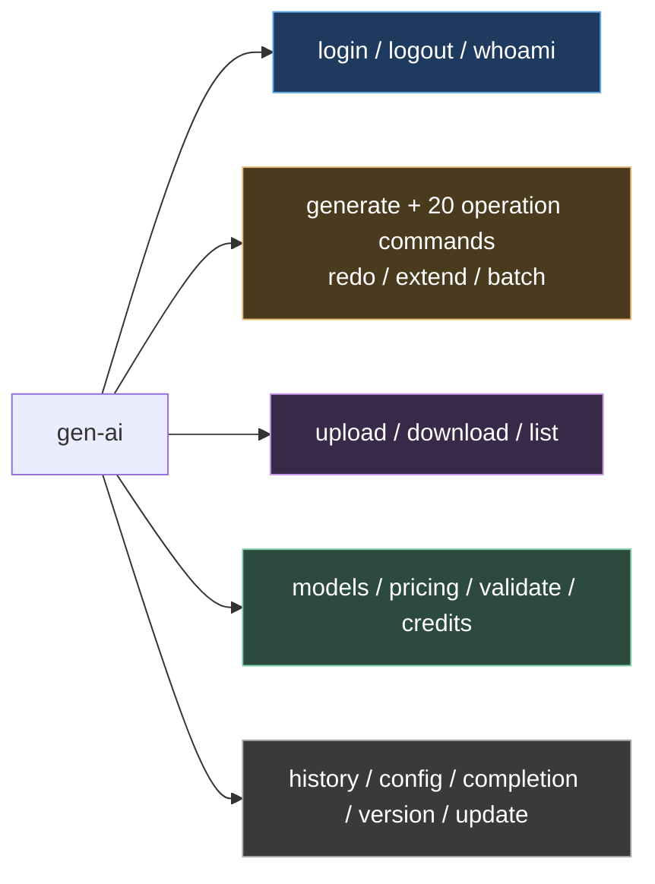

# `gen-ai` CLI — Tutorial

Hands-on guide to the `gen-ai` terminal app. Walk through it top-to-bottom on a fresh machine, or jump to a section by command. The companion reference is [cli-spec](cli-spec.md) — this page is the *how*, that page is the *what*.

> TL;DR — install once, `gen-ai login`, then `gen-ai generate -m flux-2-pro -p "sunset"`. Everything else (Drive, batch, pipes, video extend) builds on those two commands.

## Command map at a glance



`generate` is the universal entry point, but every flow also has a **dedicated operation command** with a pre-filtered model list and flow-specific prompts (see §4d).

## 1. Install

Pick one — the binary is the easiest, the workspace path is for contributors.

### 1a. Standalone binary (recommended)

Pre-built binaries for `darwin-arm64`, `darwin-x64`, `linux-x64`, `linux-arm64`, `windows-x64`. No Node.js required.

```bash
# Build all 5 targets locally (from repo root)
npm run build:cli-bin
ls dist/bin/
# darwin-arm64/gen-ai  darwin-x64/gen-ai  linux-x64/gen-ai  ...

# Or build only your platform (faster)
npm run build:cli-bin -- --only darwin-arm64

# Drop it on your PATH
cp dist/bin/darwin-arm64/gen-ai ~/bin/   # or /usr/local/bin
gen-ai --help
```

Released binaries also live at `https://picsart.com/gen-ai-cli/releases/latest.txt`. Once installed, `gen-ai update` self-updates.

### 1b. From the workspace (contributor mode)

```bash
git clone <repo>
cd ai-toolkit
npm ci
npm link         # exposes "gen-ai" on your PATH (the bin is defined in package.json)
gen-ai --help

# or without linking
npx gen-ai --help

# or run the source entry directly (no link)
node --experimental-strip-types src/index.ts --help
```

Run `gen-ai --help` to confirm. If you see a Node import error, you're on Node < 22 — `gen-ai` requires Node 22+ for `--experimental-strip-types`.

## 2. Authenticate

Browser-based **OAuth2**. `gen-ai login` opens your browser, you approve, and the CLI captures the callback on a localhost port and caches the tokens in `~/.gen-ai/credentials.json` (`0600`).

```bash
# Interactive — opens the browser, no flags
gen-ai login
# → Opening browser for authorization...
# → Logged in as you@picsart.com

# Confirm
gen-ai whoami
# → logged in as you@picsart.com — token expires 2026-05-30

# Forget the cached tokens
gen-ai logout
```

You don't usually run `login` explicitly — the first command that needs auth starts the flow for you (in a TTY).

**CI / scripts (no browser):** there's no headless login. Supply a pre-obtained token via env vars; the CLI uses it directly and never opens a browser:

```bash
export PICSART_ACCESS_TOKEN="…"
export PICSART_USER_ID="…"
gen-ai generate -m flux-2-pro -p "sunset" --no-input --quiet --json
```

If the access token expires mid-command, the CLI silently refreshes it (via the cached refresh token) and retries once on HTTP 401. You usually don't notice.

## 3. Explore the catalog

`models`, `pricing`, and `validate` are read-only and need no auth — they query the in-memory model registry shipped in `@picsart/ai-sdk`.

```bash
# Default table
gen-ai models

# Filter
gen-ai models --mode video --provider kling
gen-ai models --input-type i2v
gen-ai models --disabled                # include disabled models
gen-ai models --json | jq '.[] | .id'   # for piping

# Inspect one
gen-ai models info kling-v3
gen-ai models info "VEO 3.1"           # display-name lookup also works

# Side-by-side
gen-ai models compare kling-v3 veo-3.1

# Pricing
gen-ai pricing kling-v3                    # range + per-duration breakdown
gen-ai pricing kling-v3 --duration 10      # exact cost for these params
gen-ai pricing --all --mode video               # summary across video models

# Validate a payload without submitting
echo '{"prompt":"test","duration":99}' | gen-ai validate --model kling-v3
# → "duration" must be one of: 3, 5, 8, 10, 12, 15
gen-ai validate --model kling-v3 --schema  # show expected schema
```

## 4. Your first generation

Three styles: fully interactive, fully flag-driven, or piped.

### 4a. Interactive (zero flags)

```bash
gen-ai generate
```

The CLI walks you through: mode (image/video/audio) → input type → model picker (paginated, fuzzy-searchable, sorted by badge: hot > new+popular > new > popular) → input source → prompt → param prompts (aspect ratio, duration, …) → confirm → submit. Defaults are highlighted; press Enter to accept.

### 4b. Flag-driven

```bash
# Text → image
gen-ai generate --model flux-2-pro --prompt "sunset over mountains"

# Text → video, with params
gen-ai generate -m kling-v3 \
  -p "cinematic drone shot of a coastline" \
  -d 10 --ar 16:9 --audio

# Image → video
gen-ai generate -m kling-v3 -p "animate this photo" -i ./photo.jpg

# Multi-image (Flux Kontext, etc.)
gen-ai generate -m flux-kontext-max -p "combine these" -i ./a.jpg -i ./b.jpg

# Video → video
gen-ai generate -m wan-2.6-v2v -p "make it cinematic" --video ./clip.mp4

# Multiple outputs (for image models)
gen-ai generate -m gemini-3-pro-image -p "coffee shop logo" -n 4

# Silent (skip prompts, accept defaults)
gen-ai generate -m kling-v3 -p "test" -s
```

Local files in `--image`/`--video` are auto-uploaded before submission. URLs are passed through.

### 4c. Piped

`gen-ai` reads stdin as the prompt when stdin isn't a TTY and `-p` isn't given. Use `--no-input --quiet --json` for clean JSON; `-s`/`--silent` only disables prompts.

```bash
echo "a cat on the moon" | gen-ai generate -m flux-2-pro
cat long-prompt.txt | gen-ai generate -m kling-v3 -s

# Extract just the URL with jq
gen-ai generate -m flux-2-pro -p "sunset" --no-input --quiet --json | jq -r '.url'

# End-to-end pipe — prompt in, file out
cat prompt.txt | gen-ai generate -m flux-2-pro --no-input --quiet --json \
  | jq -r '.url' | xargs curl -o result.png

# A queue of prompts
while IFS= read -r prompt; do
  gen-ai generate -m flux-2-pro -p "$prompt" --no-input --quiet --json >> results.json
done < prompts.txt
```

Stream contract: data on stdout, info/spinners/errors on stderr. So `--quiet` is only needed to silence the decorative `info()`/`success()` lines — pipes already get clean output.

### Output handling

By default, results download to `./output/`, save to the `gen-ai-cli` Drive folder, and print the URL.

```bash
gen-ai generate -m flux-2-pro -p "sunset" --download ./out  # custom dir
gen-ai generate -m flux-2-pro -p "sunset" --json             # JSON envelope
gen-ai generate -m flux-2-pro -p "sunset" --no-save-to-drive # local only
```

### Save to Picsart Drive

```bash
# Drive save is enabled by default
gen-ai generate -m kling-v3 -p "test"

# Named subfolder (auto-created if missing)
gen-ai generate -m kling-v3 -p "test" --drive-folder "Campaign Assets"
```

Drive saves match the web app: LLM-generated descriptive filenames and ffmpeg video preview thumbnails when a video is produced.

### Preflight

```bash
echo '{"prompt":"test","duration":10}' | gen-ai validate --model kling-v3
gen-ai pricing kling-v3 --duration 10
```

Both commands are read-only; `generate` itself does not have a `--dry-run` flag.

### 4d. Dedicated operation commands

`generate` accepts any model. Each **flow** also ships as a top-level command that pre-filters the catalog and shows flow-specific prompts. They use the same explicit automation flags (`--no-input --quiet --json`) and output settings.

```bash
gen-ai image      -p "a coffee shop logo"          # text → image only
gen-ai video      -p "a drone shot of a coastline" # text → video only
gen-ai enhance    -i ./photo.jpg                    # upscale/enhance flow
gen-ai remove-bg  -i ./photo.jpg                    # background removal
gen-ai vectorize  -i ./logo.png                     # raster → SVG
gen-ai music      -p "lofi beat, 90 bpm"            # text → music
```

Full set (20): `image`, `video`, `image-to-video`, `video-edit`, `talking-photo`, `text-to-speech`, `voice-clone`, `music`, `sfx`, `video-audio`, `audio-from-text`, `remove-bg`, `change-bg`, `enhance`, `upscale`, `vectorize`, `edit-image`, `character`, `multi-image` — plus the universal `generate`. Each maps 1:1 to a `FlowSpec` (see [cli-spec](cli-spec.md) → "Operation commands" and `ARCHITECTURE.md`). Run any of them with no flags to enter the interactive wizard scoped to that flow.

Two more read-only helpers:

```bash
gen-ai credits          # show your current credit balance
gen-ai version          # CLI version (also: gen-ai -v)
gen-ai update           # self-update (binary mode) or npm reinstall
```

## 5. Iterate quickly — `redo` and `history`

Every generation appends to `~/.gen-ai/history.json`.

```bash
gen-ai history                    # last 20 (default)
gen-ai history -n 50
gen-ai history last               # full detail of the most recent run
gen-ai history files              # recently used input files
gen-ai history clear

# Re-run last — exact replay
gen-ai redo

# Re-run with overrides — anything you don't override is reused
gen-ai redo --prompt "new prompt"
gen-ai redo --model veo-3.1
gen-ai redo --ar 16:9 --duration 10
```

`redo` reconstructs the prior CLI args, merges your overrides (explicit wins), and delegates to `generate`. Most common loop while iterating on a prompt.

## 6. Folder as input — `--input-dir`

Two modes, **always explicit** (no auto-detect):

| Mode | Flag | Behavior |
|---|---|---|
| Multi-image | `--multi` | All files in the folder go into one generation as `imageUrls[]`. Max 14. |
| Batch | `--batch` | One generation per file, sharing the same model/prompt/params. |

```bash
# Combine 8 reference images into one shot
gen-ai generate -m flux-kontext-max --input-dir ./photos/ \
  -p "combine these styles" --multi

# Animate every photo in the folder
gen-ai generate -m kling-v3 --input-dir ./photos/ \
  -p "animate this photo" --batch --concurrency 5

# Filter the folder by media type
gen-ai generate -m flux-2-pro --input-dir ./assets/ --type image --batch

# Override the 30-file safety limit
gen-ai generate -m kling-v3 --input-dir ./large-set/ --batch --max-files 100
```

Forget the flag? In a TTY the CLI prompts you to pick. In `--silent` mode it errors: *"--input-dir requires --multi or --batch flag (or run interactively)"*.

## 7. Batch manifests

For heterogeneous jobs (different models and params), use a JSON manifest.

```json
{
  "defaults": { "aspectRatio": "16:9", "duration": 5 },
  "jobs": [
    {
      "id": "hero-video",
      "model": "kling-v3",
      "prompt": "cinematic hero shot",
      "duration": 10
    },
    {
      "id": "product-shot",
      "model": "flux-kontext-pro",
      "prompt": "product photography",
      "image": "./product.jpg"
    },
    {
      "id": "voiceover",
      "model": "eleven-v3",
      "prompt": "Welcome to our platform",
      "voice": "rachel"
    }
  ]
}
```

```bash
# Run with parallelism
gen-ai batch run jobs.json --concurrency 3 --output ./results/

# Status of a running batch
gen-ai batch status ./results

# Retry only failed jobs (uses the manifestPath embedded in results.json)
gen-ai batch resume ./results

# Skip downloading result files
gen-ai batch run jobs.json --no-download

# Folder-of-files batch (ephemeral manifest under the hood)
gen-ai generate --input-dir ./photos/ --batch -m kling-v3 \
  -p "animate" --concurrency 5
```

Each completed job writes to `<output>/<job-id>.<ext>` and a `results.json` summary; failed jobs keep their error so `resume` can pick them up later.

## 8. Drive workflows

`upload`, `download`, and `list` browse **accessible Drive folders** — both real Drive roots (`AI Playground`, `Image Flow`, …) and any AI Playground subfolders created from CLI flows. The `--folder` flag resolves by name across both.

### Upload

```bash
# Single file
gen-ai upload photo.jpg
gen-ai upload photo.jpg --folder "My Project"

# Whole folder, flat scan, with type filter
gen-ai upload ./renders/ --type video --folder "Campaign Assets"

# Recursive + over-the-default safety limit
gen-ai upload ./big-folder/ --recursive --max-files 100

# Preview without uploading
gen-ai upload ./renders/ --dry-run

# Globs / multi-arg
gen-ai upload *.jpg
gen-ai upload a.jpg b.png c.mp4
```

Default folder is the `AI Playground` root. `--max-files` defaults to 30 to prevent accidents — you'll get a clear error with the override hint if exceeded.

### Download

```bash
# Interactive — pick folder, then files
gen-ai download

# Whole folder
gen-ai download --folder "Campaign Assets" --all -o ./local-assets/

# Filter
gen-ai download --folder "My Project" --type video
gen-ai download --type image --all
```

Interactive picker accepts ranges (`1-5`), commas (`1,3,7`), and `all`.

### List (JSON)

`list` is built for piping. No interactive UI — pure JSON output.

```bash
# Drive root folders
gen-ai list --folders | jq '.[].name'

# All AI Playground files (default)
gen-ai list

# Files in a specific folder, filtered
gen-ai list --folder "AI Playground" --type video | jq '.[].model'

# Pluck URLs to download externally
gen-ai list --folder "Campaign Assets" --type video \
  | jq -r '.[].url' | xargs -I{} curl -O {}
```

File metadata includes `name`, `type`, `url`, `createdAt`, `model`, `prompt`, `service`, `subType`, `duration`, `aspectRatio`, `previewUrl` — fields are omitted when empty.

## 9. Extend a VEO video

VEO models support +7s extensions; chain them for longer clips.

```bash
# +7s, default model = veo-3.1
gen-ai extend --video ./clip.mp4

# Custom continuation prompt
gen-ai extend --video ./clip.mp4 -p "the camera pulls back over the city"

# Chain — +21s total across 3 iterations
gen-ai extend --video ./clip.mp4 --times 3

# With output flags
gen-ai extend --video ./clip.mp4 --download --open
gen-ai extend --video ./clip.mp4 --json
```

`--video` is required (no history fallback). The CLI auto-detects aspect ratio via `ffprobe` and forces `duration: 7` + `resolution: 720p` per VEO's extend constraints. Override AR with `--aspect-ratio` if needed.

## 10. Persistent settings — `config`

Saved to `~/.gen-ai/config.json`. Affects every subsequent run.

```bash
gen-ai config list
gen-ai config keys                                # list all valid keys
gen-ai config set defaultModel kling-v3
gen-ai config set downloadDir ~/ai-output         # `~` expands to $HOME
gen-ai config set autoOpen true
gen-ai config set autoNotify true
gen-ai config get downloadDir
gen-ai config unset defaultModel
```

Valid keys: `defaultModel`, `downloadDir`, `autoOpen`, `autoClipboard`, `autoBell`, `autoNotify`, `recentFilesCount`, `imagePreview`.

## 11. Shell completion

```bash
# bash
eval "$(gen-ai completion bash)"      # add to ~/.bashrc

# zsh
eval "$(gen-ai completion zsh)"       # add to ~/.zshrc

# fish
gen-ai completion fish > ~/.config/fish/completions/gen-ai.fish
```

Completes commands, model IDs, and flags.

## 12. Recipes

A grab-bag of patterns worth bookmarking.

### CI: render N variants and post the URLs to Slack

```bash
export PICSART_ACCESS_TOKEN="$PICSART_ACCESS_TOKEN" PICSART_USER_ID="$PICSART_USER_ID"
for prompt in "sunset" "sunrise" "noon"; do
  url=$(gen-ai generate -m flux-2-pro -p "$prompt" --no-input --quiet --json | jq -r '.url')
  curl -X POST "$SLACK_WEBHOOK" -d "{\"text\":\"$prompt → $url\"}"
done
```

### Animate every still in a Drive folder

```bash
gen-ai download --folder "Campaign Assets" --type image --all -o ./stills/
gen-ai generate -m kling-v3 --input-dir ./stills/ \
  -p "subtle cinematic motion" --batch --concurrency 5 \
  --drive-folder "Campaign Animations"
```

### Pre-flight: cost a manifest before running it

```bash
jq -r '.jobs[] | "\(.model) \(.duration // "")"' jobs.json \
  | while read m d; do
      flag=""; [ -n "$d" ] && flag="--duration $d"
      printf "%-22s " "$m"; gen-ai pricing "$m" $flag
    done
```

### Resume only failed jobs after a flaky network

```bash
gen-ai batch run jobs.json -o ./results/   # 8/10 succeed
gen-ai batch resume ./results              # only the 2 failures re-run; results merge
```

## 13. Where files live

| Path | Contents |
|------|---------|
| `~/.gen-ai/credentials.json` | cached token (`0600`) |
| `~/.gen-ai/config.json` | persistent settings (`config` command) |
| `~/.gen-ai/history.json` | generation history (`history`/`redo` commands) |
| `./output/` | default download dir for `generate` |
| `./batch-output/` | default output dir for `batch run` |

Override per-run with `--download <dir>` or `--output <dir>`; override globally with `gen-ai config set downloadDir <dir>`.

## 14. Troubleshooting

| Symptom | Likely cause | Fix |
|---------|-------------|-----|
| `not logged in` / `Not authenticated` | no cached token, no env vars, non-TTY (can't open a browser) | `gen-ai login` once in a TTY, or set `PICSART_ACCESS_TOKEN` + `PICSART_USER_ID` |
| HTTP 401 mid-command | token expired | The CLI auto-retries once. If it persists: `gen-ai logout && gen-ai login` |
| `--input-dir requires --multi or --batch` | running in `--silent` without picking a mode | Add `--multi` or `--batch` |
| `Multi-image supports max 14 files, found N` | over the multi-image cap | Use `--batch` instead, or trim the folder |
| `Found N files, max is 30` | folder over the safety limit | `--max-files <N>` to override |
| `--experimental-strip-types` error | Node < 22 in workspace mode | Upgrade Node, or use the standalone binary |
| Drive folder not found | name typo, or folder isn't accessible | `gen-ai list --folders` to see real names |
| Video extend fails AR check | source file has unusual AR ffprobe can't read | Pass `--aspect-ratio` explicitly |

For deeper diagnostics, use `validate` and `pricing` before generation, or add `--debug` / `--json` to capture detailed output.

## See also

- [cli-spec](cli-spec.md) — full command reference, flag tables, file structure, phase plan.
- client-sdk — the underlying `@picsart/ai-sdk` workflow client, registry, validation.
- api-reference — per-model payloads, vendor docs, badges.
- 09-testing — `npm test` (legacy node-runner) + co-located Vitest suites (`npx vitest run`).
- 10-deployment — release pipeline for the standalone binary.
